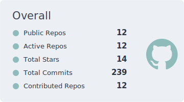
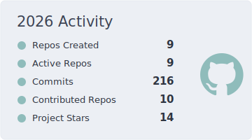

<h1 align="center">DasbootU9607</h1>

  

### AI/ML(AGI, Infra, MLLM), Quantitative Finance, HPC, CV, and Computer Graphics.

  
  
  &nbsp;
  

## About

Year 1 Computer Engineering undergraduate at Nanyang Technological University's College of Computing and Data Science.

I developed `U2INVEST`, a financial intelligence platform; built `PillowTalk`, an Andriod Digital Wellbeing APP; participated in Deep Learning Week Hackathon 2026 (`2nd Place - OpenAI Track`, `Silver Award`), SAP-NTU Hackathon 2025 (`Semi-Finalist`), SCDS TechFest Hackathon 2026, and the 2026 Jane Street Estimathon.

My current interests include AI/ML(AGI, Infra, MLLM), Quantitative Finance, HPC, CV, and Computer Graphics.

I am looking forward to research and intership opportunities in the above fields.

## GitHub Stats

  
  

## Tech Stack

  

- Languages: Python, C, C++, SQL, HTML, Assembly Language, Kotlin
- AI and Data: Pandas, NumPy, Matplotlib, Streamlit, LangChain, LangGraph, Ollama, DeepSeek V3/R1, HuggingFace Embeddings, AkShare, ChromaDB, RAG Development
- Backend and Tools: FastAPI, Docker, Git, GitHub, PowerShell, MongoDB, MySQL, SQLite
- Foundations: Data Structures, Algorithms, Object-Oriented Programming, Data Analysis and Visualization, Stock Market Analysis, API Development, Vector Databases

## Project Highlights

| Project | Summary | Tech | Links |
| --- | --- | --- | --- |
| **HaLoop** | DevSecOps safety layer for AI coding agents with approval workflows, risk scoring, and audit trails. Deep Learning Week Hackathon 2026, `2nd Place - OpenAI Track`, `Silver Award`. | `Next.js` `React` `Tailwind CSS` `SQLite` `Radix UI` `SSE` |  |
| **PillowTalk** | Android digital wellbeing app for reducing unplanned night-time phone use through blocking, focus sessions, and structured evening planning. | `Kotlin` `Jetpack Compose` `Material 3` `WorkManager` `SharedPreferences` `Vico` |  |
| **U2INVEST** | Financial intelligence platform for structured learning, AI-assisted market analysis, mock trading, and RAG-powered financial knowledge retrieval. | `Python` `LangGraph` `DeepSeek-V3` `AkShare` `ChromaDB` `Docker` `SQLite` |  |
| **ReUnion** | Career platform for personalized upskilling roadmaps, job filtering, and application tracking. SCDS TechFest Hackathon 2026. | `FastAPI` `Streamlit` `LangChain` `ChromaDB` `RAG` |  |
| **AIDE** | Multi-agent ecosystem for onboarding, learning, and career support. SAP-NTU Hackathon 2025, `Semi-Finalist`. | `Python` `Streamlit` `Telegram` `SentenceTransformers` `Ollama` `ChromaDB` |  |
