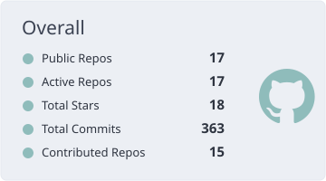
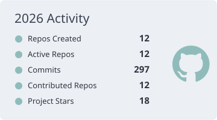

<h1 align="center">DasbootU9607</h1>

### Video Generation, World Models, and Robot Learning.

  
  
  &nbsp;
  

## About

I am a Computer Engineering Sophomore at Nanyang Technological University’s College of Computing and Data Science.

My current research interests include video generation, world models, and robot learning.

I am actively seeking research and internship opportunities where I can contribute and grow in these domains.

## GitHub Stats

  
  

## Tech Stack

  

- Languages: Python, C, C++, Java, SQL, HTML, Assembly Language
- AI and Data: Pytorch, Pandas, NumPy, Matplotlib, Streamlit, LangChain, LangGraph, Ollama, HuggingFace Embeddings, AkShare, ChromaDB, RAG Development
- Backend and Tools: FastAPI, Docker, Git, GitHub, PowerShell, MongoDB, MySQL, SQLite
- Foundations: Software Engineering and Applied AI Systems
